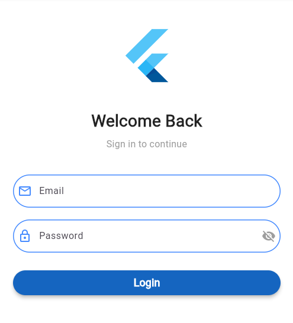
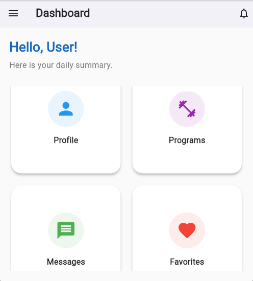
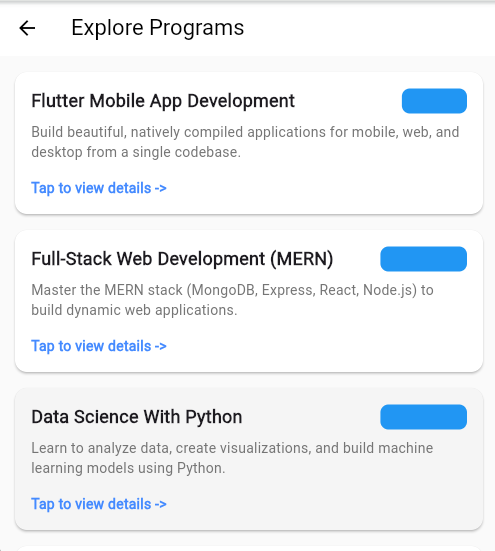
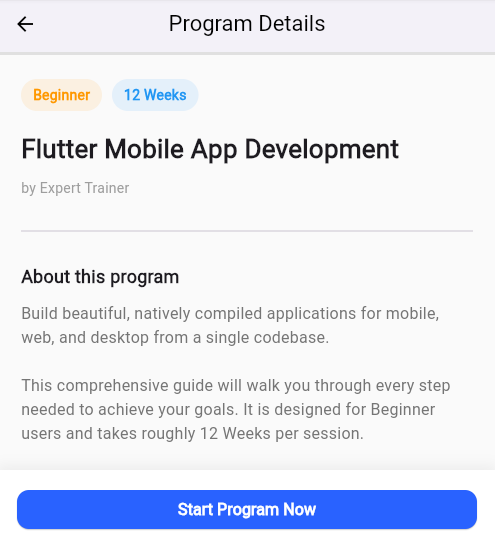

# LearnHub - Learning Platform App

## Project Vision
LearnHub is a Flutter-based learning platform app designed to provide users with online 
courses, program listings, and personal progress tracking. This project is developed as
part of my internship to demonstrate Flutter skills, UI/UX design, and GitHub version control.

## Target Users
- **Learners:** Can browse programs/courses, view details, and track progress.
- **Admins:** Can manage program listings, monitor user progress, and update content.

## Key Features
1. User Authentication (Login/Sign Up)
2. Home Dashboard for learners (shows logged-in user email)
3. Program Listing Screen backed by JSON data
4. Program Details/Profile Screen
5. Feedback form with validation
6. Basic navigation and responsive design

## Week 3 Updates (API / JSON + Forms)
- **Program Listing & Details**
  - Program list now loads from a **local JSON file** (`assets/data/programs.json`) using a repository.
  - Listing shows a **loading indicator** while data is fetched and an **error state with retry button** if loading fails.
  - Program details screen receives a `Program` object loaded from JSON.
- **Forms & Validation**
  - **Login form** now uses a `Form` with validation:
    - Email: required + valid email format.
    - Password: required + minimum 6 characters.
    - Login checks credentials saved from **Sign Up** (stored locally).
  - **Sign Up form** saves user information locally so the user can log in later.
  - On successful login, the user’s **email is passed to the Home screen** and displayed at the top.
  - **Feedback**: the Home tile opens a feedback list where you can **add / edit / delete** saved feedback entries.
  - **Feedback form** includes:
    - Name (required),
    - Email (required + valid format, pre-filled from logged-in user),
    - Feedback message (required, minimum length).
  - Feedback form shows a loading indicator while "submitting" and a success message when done.

## Project Structure
- `lib/` → Flutter app code
  - `models/program.dart` → Program model with JSON parsing.
  - `data/program_repository.dart` → Loads program data from JSON (mock API).
  - `login_screen.dart` → Login form with validation.
  - `home_screen.dart` → Dashboard showing the logged-in user’s email.
  - `program_list.dart` → Program listing using JSON data + loading/error handling.
  - `program_details.dart` → Program details UI.
  - `feedback_screen.dart` → Feedback form with validation.
- `android/` → Android-specific files
- `ios/` → iOS-specific files
- `pubspec.yaml` → Flutter project configuration and assets

## GitHub Repository
This repository demonstrates proper version control with Git. The `main` branch contains the 
initial setup, and feature branches are used for changes.

Example commit messages for Week 3:
- `Connected program listing to JSON data`
- `Added login and feedback forms with validation`
- `Added loading/error handling and updated README for Week 3`

## App Screenshots

### Login Screen

### Home Screen

### Program Listing Screen

### Program Details Screen

### Recent Updates (Week 3)
New Features: Added a functional signUp form as well as feedback form.

API Integration: Feedback Screen is now fetching the real data from a sample json file (instead of hardcoded text).

Validation: Both Forms (signUp and feedback) includes validation (can't be empty having specific amount of character).

Splash Screen: Added splash screen feature which we forgot previous week.
