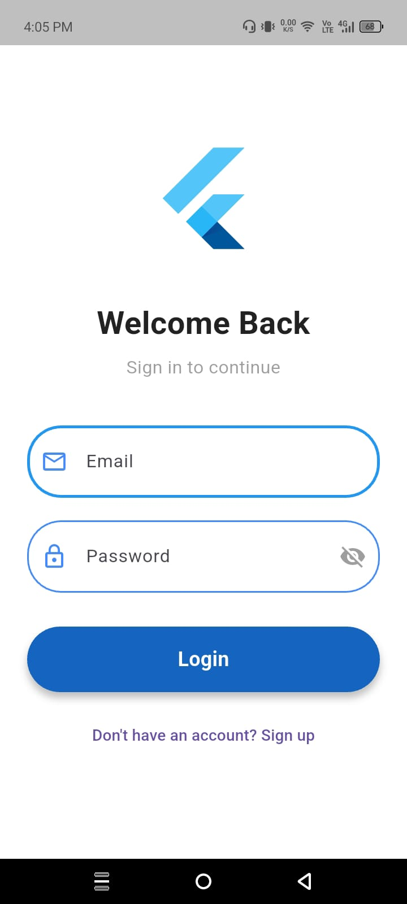
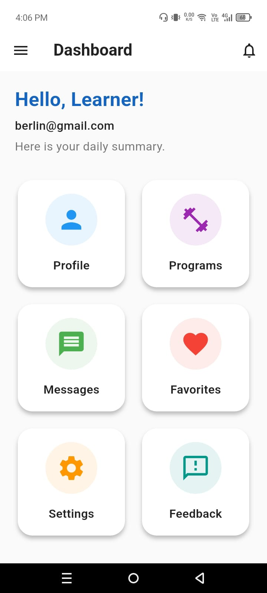
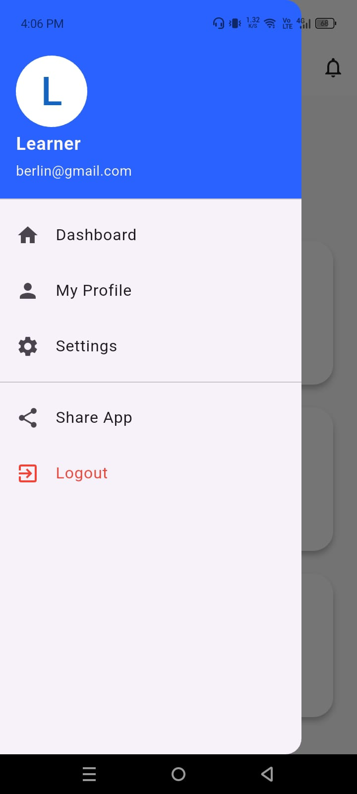
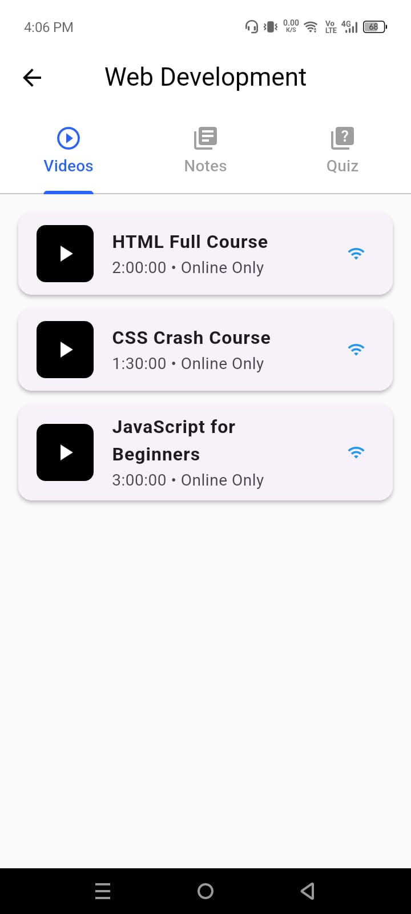
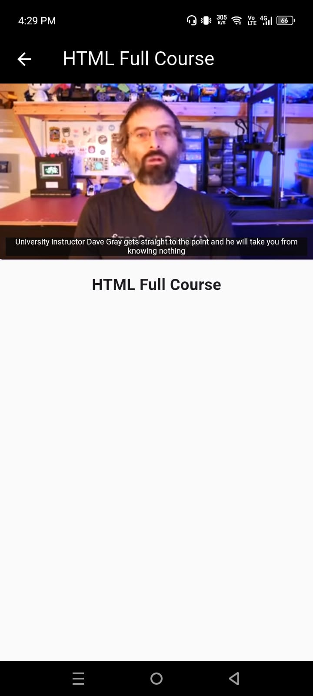
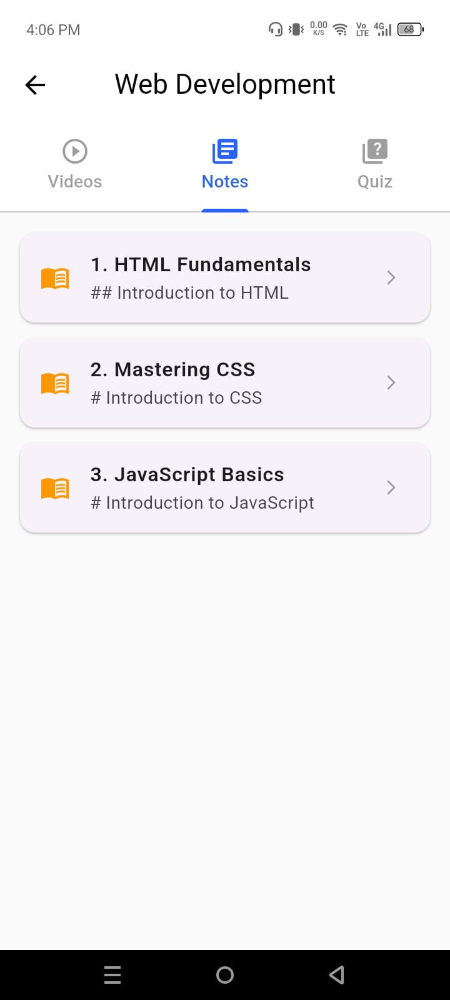
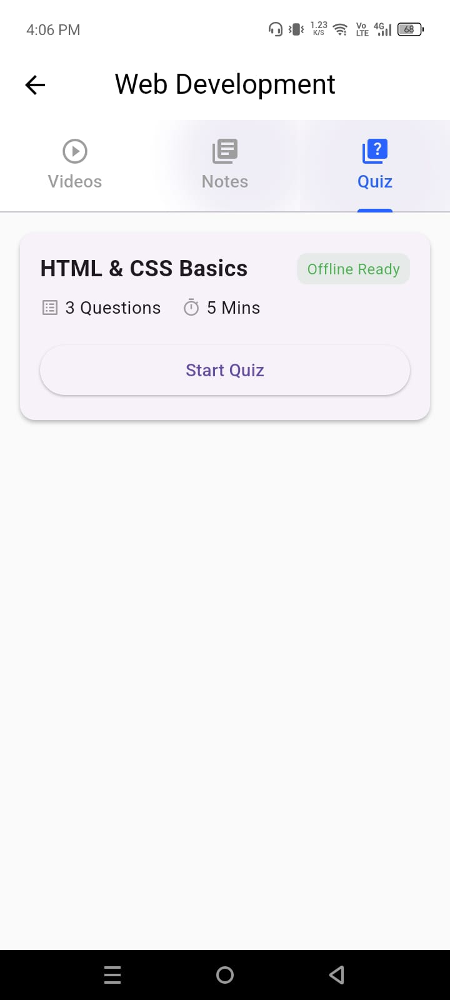
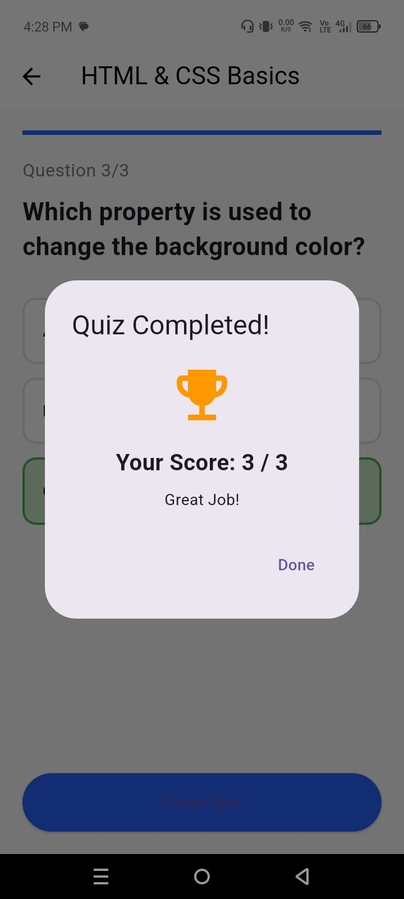

# 🚀 LearnHub - Professional E-Learning Platform

**Version:** 1.0.0
**Status:** Stable Release
**Team:**
* **Asif Javed** (Lead Developer & UI/UX)
* **Abdul Rehman Rao** (Feature Implementation)

[](https://github.com/AsifWaraich/Team15-Excelerate-Flutter-Project/releases/download/v1.0.0/app-arm64-v8a-release.apk)
[](https://www.youtube.com/watch?v=OJjC0N39MBU)

> *This project was developed as part of an internship to demonstrate proficiency in Flutter development, UI/UX design, and Version Control.*

---

## 📺 Project Demo
Watch the full walkthrough of the app features:

[](https://www.youtube.com/watch?v=OJjC0N39MBU)
*(Click the image above to watch the video)*

## 📱 App Screenshots
| **Login & Auth** | **Dashboard** | **Navigation** | **Course Listing** |
|:---:|:---:|:---:|:---:|
|  |  |  |  |

| **Video Player** | **Offline Notes** | **Quiz Interface** | **Score Result** |
|:---:|:---:|:---:|:---:|
|  |  |  |  |

---

## 1. Project Vision
LearnHub is a comprehensive mobile e-learning application built with Flutter. It is designed to democratize access to technical education by providing a structured learning environment. Users can access video tutorials, detailed reading materials, and interactive assessments across disciplines like Web Development, App Development, Data Science, and Cybersecurity.

## 2. Target Users
- **Learners:** Can browse programs, watch video lessons, read offline notes, take quizzes, and track scores.
- **Mentors/Admins:** Can manage program listings and monitor student progress.

## 3. Key Features
### Core Experience
* **User Onboarding:** A smooth entry flow with Splash Screen and a 3-slide introduction to the app's value.
* **Authentication:** Secure Login and Sign-Up flows with input validation.
* **Dashboard:** A grid-based central hub displaying available courses and the user's profile status.

### Learning Engine
* **Video Integration:** Embedded YouTube video player for seamless viewing of course lectures.
* **Offline Notes:** Markdown-style reader for studying theory without an internet connection.
* **Interactive Quizzes:** Real-time assessment system with immediate feedback (Green/Red indicators) and score calculation.

### Technical Features
* **Repository Pattern:** Separation of concerns using a Data Repository to manage course content.
* **Form Validation:** Strict validation logic for Email, Password, and Feedback forms.
* **Responsive Design:** Optimized UI that adapts to different screen sizes.

## 4. Tech Stack
* **Framework:** Flutter (Dart)
* **Architecture:** MVC (Model-View-Controller) with Repository Pattern.
* **State Management:** `setState` for local UI state and callbacks for data flow.
* **IDE:** Android Studio / VS Code.

## 5. Project Structure
The codebase is organized for scalability:

- `lib/`
    - `models/` → Data models (`program.dart`, `feedback_item.dart`) for structured data parsing.
    - `data/` → `program_repository.dart` (Manages Courses, Videos, Notes, and Quiz Data).
    - `screens/`
        - `splash_screen.dart` → Branded entry point.
        - `onboarding_screen.dart` → Feature introduction slider.
        - `login_screen.dart` → Authentication logic.
        - `home_screen.dart` → Main navigation hub with Side Drawer.
        - `program_details.dart` → Tab-based course view (Videos, Notes, Quiz).
        - `quiz_screen.dart` → Interactive testing engine.
    - `widgets/` → Reusable UI components (Drawer, Video Player).

## 6. Installation & Setup
To run this project locally:

1.  **Clone the repository:**
    ```bash
    git clone [https://github.com/AsifWaraich/Team15-Excelerate-Flutter-Project.git](https://github.com/AsifWaraich/Team15-Excelerate-Flutter-Project.git)
    ```
2.  **Install dependencies:**
    ```bash
    flutter pub get
    ```
3.  **Run the app:**
    ```bash
    flutter run
    ```

## ⬇️ Download the App
Try the app on your Android device right now!

[](https://github.com/AsifWaraich/Team15-Excelerate-Flutter-Project/releases/download/v1.0.0/app-arm64-v8a-release.apk)

*(Note: Since this is not from the Play Store, you may need to "Allow installation from unknown sources" in your settings.)*

